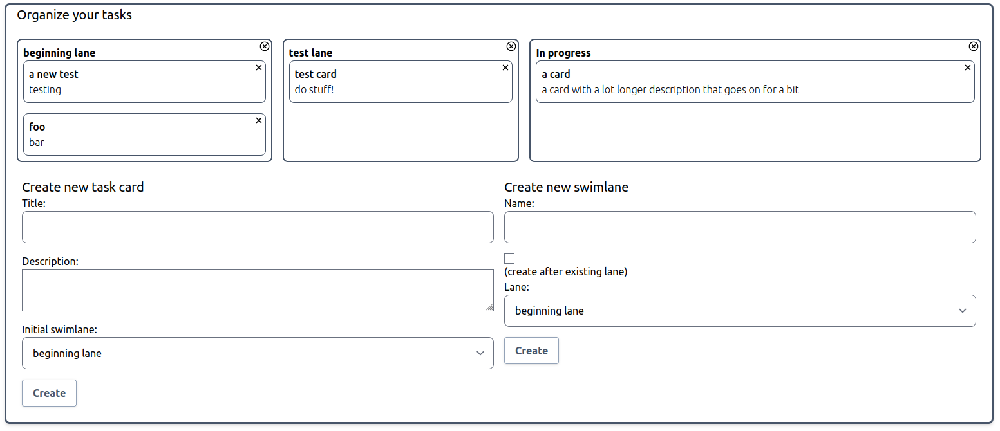

# denojira

A Jira clone. This project is an experiment to see what is involved with porting a legacy framework-less React application to the Deno runtime instead of Node.JS.

## Stack

Uses

- [Deno](https://deno.land)
- [Deno postgresql driver](https://deno-postgres.com/#/)
- [Esbuild](https://esbuild.github.io/)
- [Oak](https://oakserver.github.io/oak/) (similar to Koa)
- React (SSR)
- [WindiCSS](https://windicss.org/)

## Run it

### With Docker

`docker compose --profile migrate up --build`

For subsequent runs, omit the `--profile migrate` to not re-run the migration job. The migration job is currently destructive and will delete the entire dockerized database.

### On host

1. Setup the DB manually via init.sql
1. `deno install --allow-net --allow-read --allow-write -n esbuild https://deno.land/x/esbuild@v0.15.16/mod.js`
1. Run `./run.sh`

Navigate to http://localhost:8000

## Development

### Server

At the moment, the server is set up around supporting a dev setup where most assets are generated when requested. Future work will be to have the web server host a pre-built JS bundle and prebuilt CSS.

### Setup

## Ops

### Create a swim lane

`curl -X POST -H "Content-Type:application/json" http://localhost:8000/api/lane -d '{"name":"test lane", "precedence": 10}'`

### Get the current swim lanes

`curl http://localhost:8000/api/lanes`
